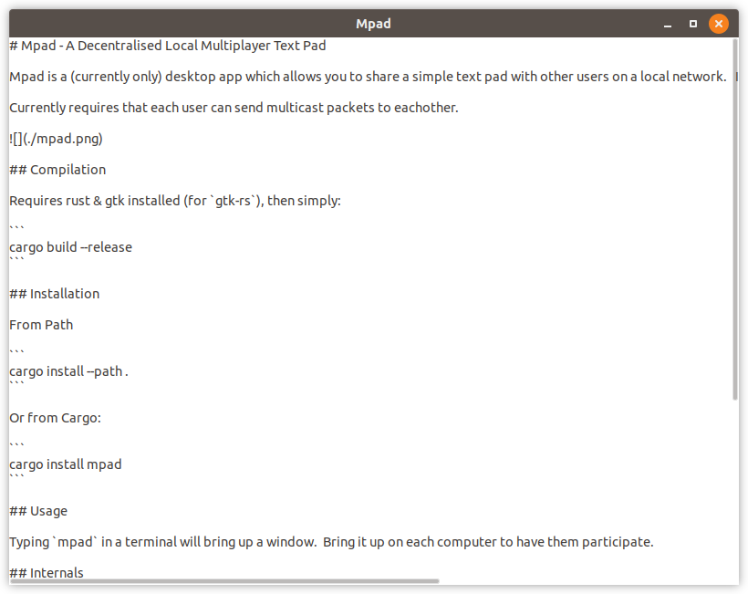

# Mpad - A Decentralised Local Multiplayer Text Pad

Mpad is a desktop app (mobile/web clients planned!) which allows you to share a simple text pad with other users on a local network:



Any changes you make on one mpad instance are instantly reflected to all other pcs using a CRDT for conflict resolution via multicast.

It was borne out of a frustration to have a shared clipboard between a few laptops around the office.


## Compilation

Requires rust & gtk installed (for `gtk-rs`), then simply:

```
cargo build --release
```

## Installation

From Path 

```
cargo install --path .
```

Or from Cargo:

```
cargo install mpad
```

## Usage

Typing `mpad` in a terminal will bring up a window.  Bring it up on each computer to have them participate.

## Internals

Uses a slimmed down version of the existing [ditto](https://github.com/alex-shapiro/ditto) CRDT library (with an extra function or two added).

The [multicast.rs](src/multicast.rs) does all the heavy lifting here!

* Users type something
* Updates its local CRDT using a diff 
* If there are changes, submits them in partial chunks to a multicast address (currently hardcoded to `239.1.1.1:1111`)
* Receives updates from the multicast address
* Merges the remote state with the local CRDT

This is exposed by a channel so it should be easy-ish to plug it into other frontends:

```rust
pub fn setup_channels() -> Result<(Sender<String>, Receiver<String>), Error>;
```

Where sender is where you send updates from your text pad, and receiver is where you receive updates from the wire.